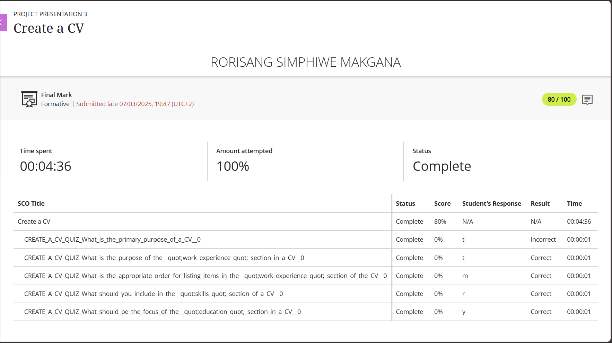
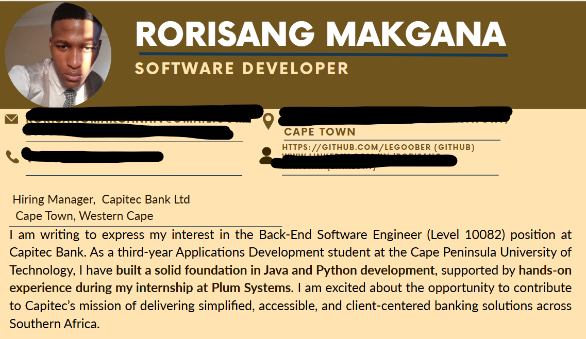

# PRP3-professional_practice_3--Creating_a_CV

## 📝 4. Create a CV

### 📂 Evidence
- Link to CV Markdown on GitHub
- 
- 

### 💭 Reflection (STAR)
**S**ituation: For my Project Presentation Module, we were tasked with the creation of a professional CV tailored to the tech industry. In understanding our roles within our respective streams, we had to go applying for jobs that cater to our respective fields of study and in that we had a formative assessment called 'Create a CV', where we we're briefed on:
 - what the primary purposes of a CV are,
 - understanding the appropriate structuring of the CV, and,
 - what should be included within the CV itself, ranging from the experience to our own information
  
**T**ask: In creating my CV, I had to highlight my all my skills, projects, and education in a manner that clearly aligns to the current jobs that we available.

**A**ction: By using a professional Canva template, I'd ensured that the template I'd selected was easily customizable to add my own features that created a clean, modern CV. Through using GitHub and Markdown, I'd ensured to understand the concepts of creating README files and portfolios that would display to recruiters the competency and confidence in using these tools.

**R**eflection: I’m now confident that my CV has effectively showcased my potential and is always able to be structured in such a manner that keeps it as up to date and as relevant to the jobs which are directed to software engineering roles 

---
